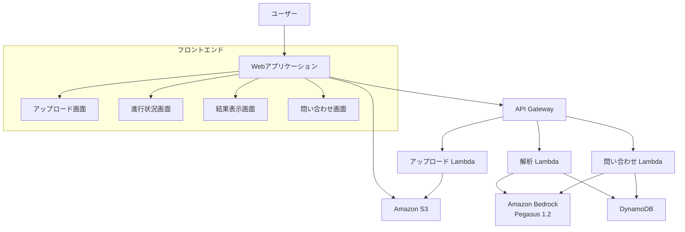

# 設計文書

## 概要

Amazon Bedrock の TwelveLabs Pegasus 1.2 を使用した動画解析デモWebアプリケーションの設計文書です。このアプリケーションは、サーバーレスアーキテクチャを採用し、動画のアップロード、解析、結果表示、自然言語問い合わせ機能を提供します。

## アーキテクチャ

### 全体アーキテクチャ



### レイヤー構成

1. **プレゼンテーション層**: HTML5 + CSS3 + Vanilla JavaScript
2. **API層**: AWS API Gateway + Lambda Functions
3. **ビジネスロジック層**: Lambda Functions (Node.js)
4. **データ層**: Amazon S3 (動画ファイル) + DynamoDB (メタデータ・結果)
5. **AI/ML層**: Amazon Bedrock (TwelveLabs Pegasus 1.2)
6. **インフラ層**: AWS CDK (TypeScript) - インフラストラクチャのコード化

## コンポーネントと インターフェース

### フロントエンドコンポーネント

#### 1. UploadComponent
- **責務**: 動画ファイルのアップロード処理
- **機能**:
  - ファイル形式検証（MP4、MOV、AVI、MKV、WEBM、MXF、FLV、WMV、M4V）
  - ファイルサイズ制限チェック
  - 進行状況表示
  - エラーハンドリング

#### 2. ProgressComponent
- **責務**: 解析進行状況の表示
- **機能**:
  - リアルタイム進行状況更新
  - 推定残り時間表示
  - キャンセル機能
  - エラー状況表示

#### 3. ResultsComponent
- **責務**: 解析結果の表示
- **機能**:
  - 基本解析結果表示
  - PR文章表示（200文字・500文字）
  - あらすじ表示（200文字・500文字）
  - 結果のコピー機能
  - JSON エクスポート機能

#### 4. QueryComponent
- **責務**: 自然言語問い合わせ処理
- **機能**:
  - 質問入力フォーム
  - 質問履歴管理
  - 回答表示
  - 信頼度・根拠表示

### バックエンドコンポーネント

#### 1. UploadHandler (Lambda)
- **責務**: 動画ファイルのアップロード処理
- **機能**:
  - S3 プリサインドURL生成
  - ファイル検証
  - メタデータ保存
  - ウイルススキャン

#### 2. AnalysisHandler (Lambda)
- **責務**: 動画解析の実行
- **機能**:
  - Pegasus 1.2 API呼び出し
  - 基本解析実行
  - PR文章生成
  - あらすじ生成
  - 結果の日本語化
  - 進行状況更新

#### 3. QueryHandler (Lambda)
- **責務**: 自然言語問い合わせ処理
- **機能**:
  - 質問の解析
  - Pegasus 1.2 への問い合わせ
  - 回答生成
  - 文脈保持

#### 4. StatusHandler (Lambda)
- **責務**: 処理状況の管理
- **機能**:
  - 進行状況追跡
  - エラー状況管理
  - 通知処理

#### 5. CleanupHandler (Lambda)
- **責務**: ファイルライフサイクル管理
- **機能**:
  - 古い動画ファイルの自動削除
  - 一時ファイルのクリーンアップ
  - ストレージ使用量監視
  - DynamoDB レコードとS3オブジェクトの整合性チェック

#### 6. CDK Infrastructure
- **責務**: インフラストラクチャのコード化
- **機能**:
  - Lambda関数のデプロイ
  - S3バケットとライフサイクルポリシー設定
  - DynamoDB テーブル作成
  - API Gateway設定
  - IAM ロール・ポリシー管理
  - CloudWatch ログ・メトリクス設定

## データモデル

### DynamoDB テーブル設計

#### VideoAnalysisTable
```json
{
  "videoId": "string (PK)",
  "uploadTimestamp": "number (SK)",
  "fileName": "string",
  "fileSize": "number",
  "duration": "number",
  "format": "string",
  "s3Key": "string",
  "status": "string", // UPLOADED, ANALYZING, COMPLETED, FAILED
  "progress": "number", // 0-100
  "basicAnalysis": {
    "summary": "string",
    "scenes": "array",
    "objects": "array",
    "activities": "array"
  },
  "prTexts": {
    "short": "string", // 200文字
    "long": "string"   // 500文字
  },
  "summaries": {
    "short": "string", // 200文字
    "long": "string"   // 500文字
  },
  "createdAt": "string",
  "updatedAt": "string"
}
```

#### QueryHistoryTable
```json
{
  "videoId": "string (PK)",
  "queryId": "string (SK)",
  "question": "string",
  "answer": "string",
  "confidence": "number",
  "timeReferences": "array",
  "timestamp": "string"
}
```

### S3 バケット構成とライフサイクル管理

```
video-analyzer-bucket/
├── uploads/
│   └── {videoId}/
│       └── original.{ext}        # 7日後自動削除
├── processed/
│   └── {videoId}/
│       ├── thumbnails/           # 30日後自動削除
│       └── segments/             # 30日後自動削除
└── temp/
    └── {videoId}/                # 1日後自動削除
```

#### S3 ライフサイクルポリシー
- **temp/**: 1日後に自動削除
- **uploads/**: 7日後に自動削除（解析完了後）
- **processed/**: 30日後に自動削除
- **古いバージョン**: 即座に削除
- **不完全なマルチパートアップロード**: 1日後に削除

#### ストレージクラス移行
- **Standard**: アップロード時
- **Standard-IA**: 30日後（アクセス頻度低下）
- **Glacier**: 90日後（長期保存）
- **Deep Archive**: 365日後（アーカイブ）

## Correctness Properties

*プロパティとは、システムの全ての有効な実行において真であるべき特性や動作のことです。これは人間が読める仕様と機械で検証可能な正確性保証の橋渡しをする正式な記述です。*

### Property 1: ファイル形式検証の完全性
*任意の* アップロードファイルに対して、対応フォーマット（MP4、MOV、AVI、MKV、WEBM、MXF、FLV、WMV、M4V）のファイルは受け入れられ、非対応フォーマットや無効なファイルは適切なエラーメッセージと共に拒否される
**検証対象: 要件 1.1, 1.5**

### Property 2: ファイルサイズ制限の遵守
*任意の* アップロードファイルに対して、制限を超えるサイズのファイルはエラーメッセージと共に拒否される
**検証対象: 要件 1.2**

### Property 3: 必須解析機能の完全実行
*任意の* 有効な動画ファイルに対して、解析処理が開始されると基本解析、PR文章生成（200文字・500文字）、あらすじ生成（200文字・500文字）の全てが実行され、結果が統合表示される
**検証対象: 要件 2.1, 2.4**

### Property 4: 進行状況表示の一貫性
*任意の* 解析処理において、進行状況がパーセンテージで表示され、エラー発生時は詳細なエラー内容が報告される
**検証対象: 要件 3.1, 3.2**

### Property 5: 解析結果の構造化表示
*任意の* 解析完了時において、結果は機能別にカテゴリ分けされ、テキスト情報は日本語で読みやすい形式で表示され、JSON形式でエクスポート可能である
**検証対象: 要件 4.1, 4.2, 4.5**

### Property 6: PR文章・あらすじ生成の完全性
*任意の* 動画解析完了時において、200文字と500文字のPR文章、200文字と500文字のあらすじが生成され、それぞれが明確に区別されて表示され、ワンクリックでコピー可能である
**検証対象: 要件 6.1, 6.2, 6.4, 6.5, 6.7, 6.8**

### Property 7: 自然言語問い合わせの文脈保持
*任意の* 動画に対する連続した質問において、質問履歴が保持され、文脈を考慮した回答が生成され、回答には信頼度と根拠となる時間帯が含まれる
**検証対象: 要件 7.7, 7.8**

### Property 8: 時間帯参照の正確性
*任意の* 動画の特定部分に関する質問において、回答には該当する時間帯の情報が含まれる
**検証対象: 要件 7.6**

### Property 9: 日本語対応の完全性
*任意の* システム出力（解析結果、PR文章、あらすじ、エラーメッセージ、UI要素、機能説明、制限事項、問い合わせ回答）は日本語で表示される
**検証対象: 要件 8.1, 8.2, 8.3, 8.4, 8.5, 8.6, 8.7**

### Property 10: セキュリティ処理の完全性
*任意の* アップロードされた動画ファイルに対して、ウイルススキャンが実行され、暗号化されたストレージに保存され、解析完了後に一時ファイルが自動削除される
**検証対象: 要件 9.1, 9.2, 9.3**

## エラーハンドリング

### エラー分類と対応

#### 1. ユーザー入力エラー
- **無効なファイル形式**: 対応フォーマット一覧と共にエラー表示
- **ファイルサイズ超過**: 制限値と共にエラー表示
- **ネットワークエラー**: 再試行オプション提供

#### 2. システムエラー
- **Bedrock API エラー**: 詳細なエラーコードと対処法表示
- **Lambda タイムアウト**: 処理継続または再開オプション
- **DynamoDB エラー**: データ整合性チェックと復旧処理

#### 3. リソース制限エラー
- **同時処理数制限**: 待機キューと推定待ち時間表示
- **API レート制限**: 自動リトライとバックオフ実装
- **ストレージ容量**: 古いファイルの自動削除

### エラー回復戦略

1. **指数バックオフリトライ**: 一時的な障害に対する自動復旧
2. **サーキットブレーカー**: 連続障害時のシステム保護
3. **グレースフルデグラデーション**: 部分的な機能提供
4. **ユーザー通知**: 明確なエラー説明と次のアクション提示

## インフラストラクチャ管理

### AWS CDK 構成

#### CDK スタック構成
```typescript
// メインスタック
export class VideoAnalyzerStack extends Stack {
  // S3 バケット（ライフサイクルポリシー付き）
  // DynamoDB テーブル
  // Lambda 関数群
  // API Gateway
  // IAM ロール・ポリシー
}

// 開発環境スタック
export class VideoAnalyzerDevStack extends VideoAnalyzerStack {
  // 開発用設定（短いライフサイクル、小さいリソース）
}

// 本番環境スタック  
export class VideoAnalyzerProdStack extends VideoAnalyzerStack {
  // 本番用設定（長いライフサイクル、スケーラブルリソース）
}
```

#### リソース管理
- **環境分離**: dev, staging, prod 環境の独立管理
- **タグ付け**: コスト管理とリソース追跡
- **セキュリティ**: 最小権限の原則に基づくIAM設定
- **監視**: CloudWatch メトリクス・アラーム自動設定
- **バックアップ**: DynamoDB の自動バックアップ設定

### ファイルライフサイクル管理

#### 自動クリーンアップ戦略
1. **即座削除**: 処理失敗時の一時ファイル
2. **1日後削除**: temp/ ディレクトリの全ファイル
3. **7日後削除**: uploads/ の元動画ファイル（解析完了後）
4. **30日後削除**: processed/ の処理済みファイル
5. **手動削除**: ユーザーリクエストによる即座削除

#### ストレージ最適化
- **重複排除**: 同一ファイルのハッシュチェック
- **圧縮**: 長期保存ファイルの自動圧縮
- **コスト監視**: 日次ストレージコストレポート
- **容量制限**: ユーザー/全体の容量制限設定

## テスト戦略

### 単体テスト
- **フロントエンドコンポーネント**: Jest + jsdom
- **Lambda関数**: Jest + AWS SDK モック
- **ユーティリティ関数**: 純粋関数のテスト

### 統合テスト
- **API エンドポイント**: Postman/Newman
- **Bedrock 連携**: 実際のAPIを使用したテスト
- **S3 + DynamoDB**: データフロー検証

### プロパティベーステスト
- **テストライブラリ**: fast-check
- **実行回数**: 最低100回の反復実行
- **各プロパティ**: 設計文書のCorrectness Propertiesに対応

### E2Eテスト
- **ブラウザテスト**: Puppeteer
- **ユーザーフロー**: アップロードから結果表示まで
- **エラーシナリオ**: 各種エラー条件のテスト

### パフォーマンステスト
- **負荷テスト**: 同時アップロード処理
- **ストレステスト**: リソース制限下での動作
- **レスポンス時間**: 各API の応答時間測定